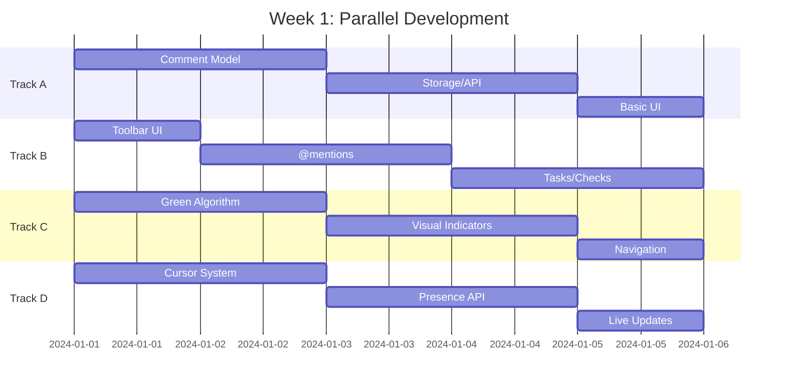

# 🚀 Parallel Development Plan for Rizzoma Features

## Overview
By working on features in parallel across 3-4 development tracks, we can reduce the timeline from 8-12 weeks to **3-4 weeks** for core features.

## 🎯 Sprint 1 (Week 1-2): Foundation & Core Features

### Track A: Inline Comments System
**Developer 1 Focus**
- [ ] Text selection tracking & range management
- [ ] Comment data model & storage
- [ ] Comment anchoring to text ranges
- [ ] Basic comment UI components

### Track B: Rich Editor & UI
**Developer 2 Focus**
- [ ] Rich text formatting toolbar
- [ ] @mentions autocomplete system
- [ ] Task/checkbox support
- [ ] Inline blip creation (type & split)

### Track C: Navigation & Visual Feedback
**Developer 3 Focus**
- [ ] "Follow the green" highlighting system
- [ ] Visual diff tracking for changes
- [ ] Enhanced navigation with visual guides
- [ ] Unread content highlighting

### Track D: Real-time Enhancements
**Developer 4 Focus**
- [ ] Collaborative cursors/presence
- [ ] Real-time comment updates
- [ ] Live typing indicators
- [ ] Conflict resolution for concurrent edits

## 🎯 Sprint 2 (Week 3-4): Integration & Polish

### All Tracks Converge:
- [ ] Integrate inline comments with editor
- [ ] Connect visual feedback to navigation
- [ ] Unify real-time features
- [ ] Performance optimization
- [ ] Mobile responsiveness
- [ ] Testing & bug fixes

## 📋 Parallel Task Breakdown

### Can Start Immediately (No Dependencies):
```
Track A: Comment Backend     Track B: Editor UI        Track C: Visual Systems
- Comment model             - Toolbar component       - Diff algorithm
- Storage schema           - Format buttons          - Green highlight CSS
- Range tracking           - @mention UI             - Change tracking
- API endpoints            - Task checkbox UI        - Visual indicators
```

### Week 1 Checkpoints:
- **Monday**: All tracks have basic prototypes
- **Wednesday**: First integration test
- **Friday**: Demo of each track's progress

### Week 2 Focus:
```
Track A + B: Comments meet Editor
- Selection → Comment creation
- Comment rendering in editor
- Reply threading

Track C + D: Visual meets Real-time
- Green highlights update live
- Cursor positions shared
- Navigation enhanced
```

## 🛠️ Technical Approach

### 1. **Modular Architecture**
```typescript
// Each track develops independent modules
modules/
  ├── comments/          # Track A
  ├── editor-ui/         # Track B  
  ├── visual-feedback/   # Track C
  └── realtime/         # Track D
```

### 2. **API-First Design**
- Define interfaces first
- Mock APIs for parallel work
- No blocking between tracks

### 3. **Feature Flags**
```typescript
const FEATURES = {
  INLINE_COMMENTS: process.env.FEAT_COMMENTS === '1',
  RICH_TOOLBAR: process.env.FEAT_TOOLBAR === '1',
  FOLLOW_GREEN: process.env.FEAT_GREEN === '1',
  LIVE_CURSORS: process.env.FEAT_CURSORS === '1'
};
```

## 📊 Resource Allocation

### Option 1: 4 Developers (3-4 weeks)
- Each owns a track
- Daily sync meetings
- Weekly integration sprints
- **Result**: Core Rizzoma in 1 month

### Option 2: 2 Developers (5-6 weeks)
- Dev 1: Tracks A & C
- Dev 2: Tracks B & D
- More context switching
- **Result**: Core Rizzoma in 1.5 months

### Option 3: 1 Developer + AI Assistance (6-8 weeks)
- Human: Architecture & complex features
- AI: Boilerplate, tests, UI components
- Parallel AI sessions for different tracks
- **Result**: Core Rizzoma in 2 months

## 🎮 Quick Wins (Can ship in days)

### Day 1-3 Quick Wins:
1. **Rich Text Toolbar** (Track B)
   - TipTap already supports it
   - Just needs UI wrapper
   - 1-2 days work

2. **Basic @mentions** (Track B)
   - Simple autocomplete
   - User search endpoint
   - 2-3 days work

3. **Visual Unread Indicators** (Track C)
   - CSS styling for unread
   - Simple green borders
   - 1 day work

4. **Task Checkboxes** (Track B)
   - TipTap extension
   - Task toggle API
   - 1-2 days work

## 🚦 Implementation Order

### Phase 1: MVP (Week 1)


## 💡 Acceleration Strategies

### 1. **Use Existing Libraries**
- **Inline Comments**: Use `rangy` or `annotator.js` as base
- **@mentions**: Use `tribute.js` or `mention.js`
- **Rich toolbar**: Use TipTap's `StarterKit`
- **Cursors**: Use `y-presence` from Yjs

### 2. **Copy from Legacy**
- Reuse CSS from old Rizzoma
- Port algorithms where possible
- Adapt UI patterns that worked

### 3. **Progressive Enhancement**
- Ship basic version fast
- Enhance incrementally
- Feature flag everything

## 📈 Success Metrics

### Week 1 Goals:
- [ ] 4 independent features working
- [ ] No blocking between tracks
- [ ] First integration successful

### Week 2 Goals:
- [ ] All features integrated
- [ ] "Follow green" working
- [ ] Inline comments functional
- [ ] Rich editor complete

### Week 3-4 Goals:
- [ ] Polish & performance
- [ ] Mobile responsive
- [ ] Full test coverage
- [ ] Production ready

## 🏃‍♂️ Start Commands

```bash
# Start all feature branches
git checkout -b feature/inline-comments  # Track A
git checkout -b feature/rich-editor      # Track B  
git checkout -b feature/follow-green     # Track C
git checkout -b feature/realtime-cursors # Track D

# Enable features progressively
FEAT_COMMENTS=1 FEAT_TOOLBAR=1 npm run dev
```

## 🎯 The Result

**In 3-4 weeks with parallel development:**
- ✅ Inline commenting (the killer feature)
- ✅ "Follow the green" navigation
- ✅ Rich text editing with toolbar
- ✅ @mentions and tasks
- ✅ Real-time collaborative cursors
- ✅ Inline blip creation
- ✅ The full "Rizzoma feel"

**This is 3x faster than sequential development!**