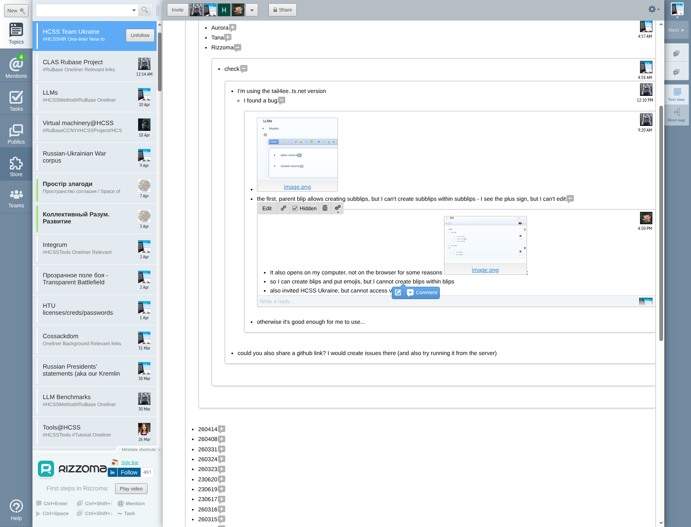
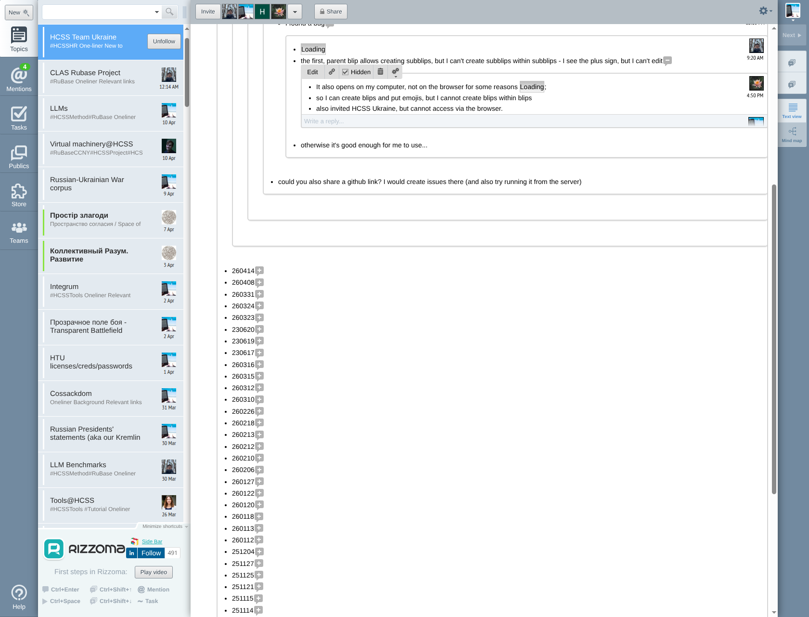
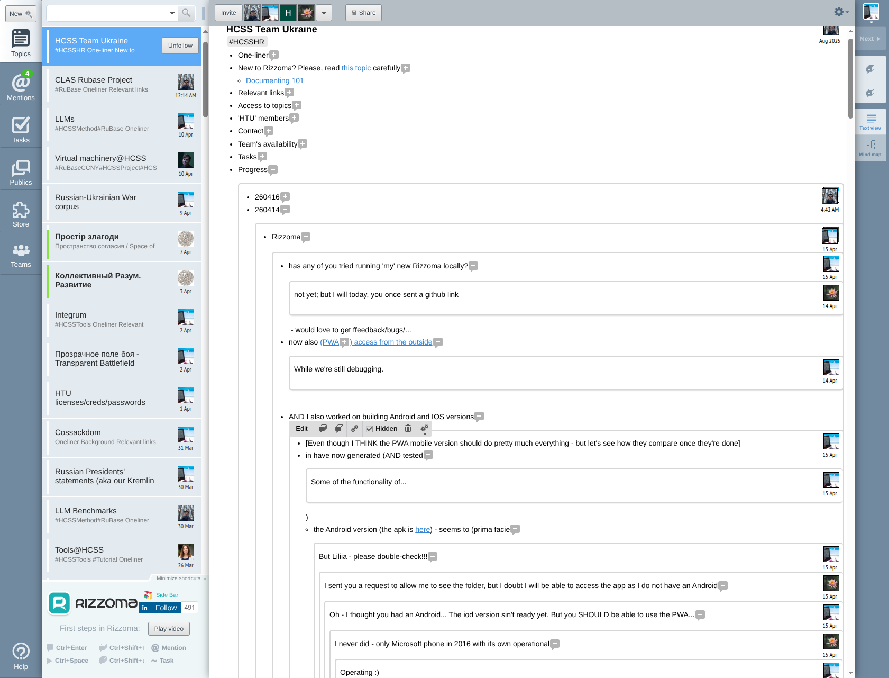
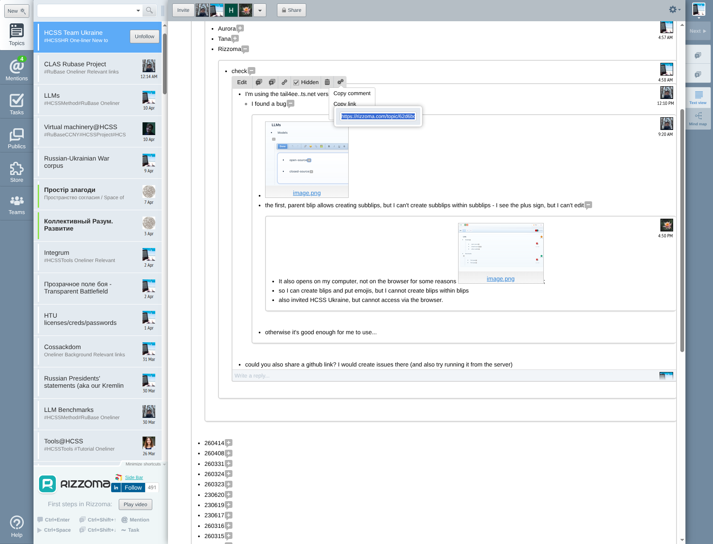
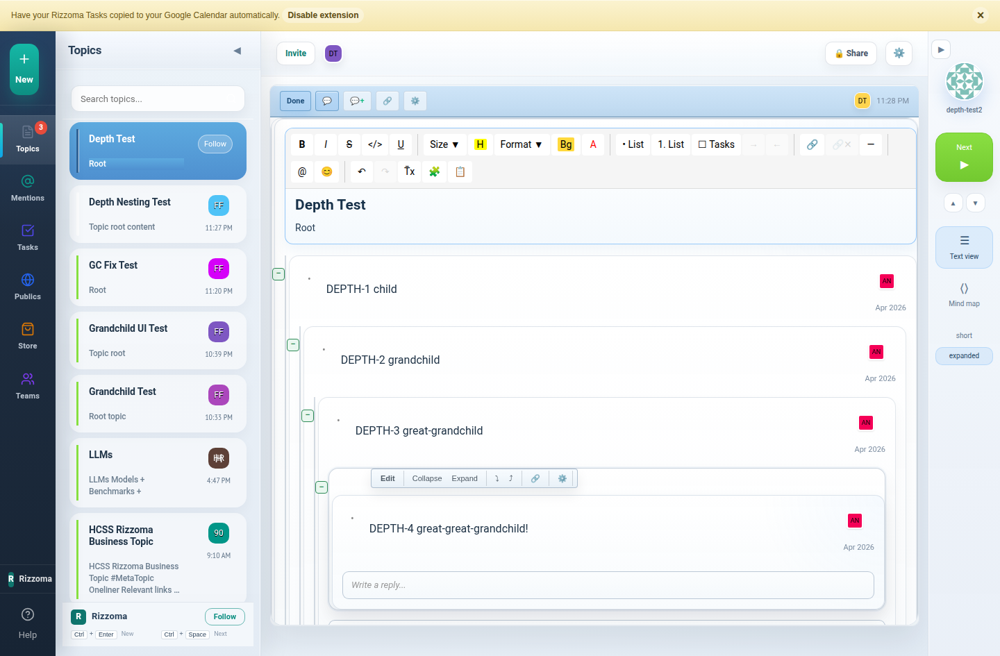

# BUG: Sub-blip nesting — "I cannot create blips within blips"

**Date**: 2026-04-16
**Reporters**: Hryhorii (9:20 AM), Liliia (4:50 PM)
**Location**: [HCSS Team Ukraine topic](https://rizzoma.com/topic/62d6bdc5ec1c533e13df57763219272c)
**Severity**: HIGH — core BLB functionality broken for real users
**Status**: ✅ FIXED (commit `222efc97`)
**Issue**: [HCSS-StratBase/rizzoma#40](https://github.com/HCSS-StratBase/rizzoma/issues/40)

---

## Bug reports (verbatim from original Rizzoma)

### Hryhorii ([blip link](https://rizzoma.com/topic/62d6bdc5ec1c533e13df57763219272c/0_b_cjjg_cp2tg/))
> "the first, parent blip allows creating subblips, but I can't create subblips within subblips - I see the plus sign, but I can't edit"



### Liliia ([blip link](https://rizzoma.com/topic/62d6bdc5ec1c533e13df57763219272c/0_b_cjjg_cp309/))
> "so I can create blips and put emojis, but I cannot create blips within blips"
> "also invited HCSS Ukraine, but cannot access via the browser"



---

## Root cause

**One wrong boolean in a function call.**

`src/client/components/RizzomaTopicDetail.tsx` line 1392:

```tsx
// BEFORE (broken):
const handleRefresh = () => {
  load(true, true);  // fromSocket=true → hits 10s SOCKET_COOLDOWN_MS
};

// AFTER (fixed):
const handleRefresh = () => {
  load(true, false);  // fromSocket=false → always reloads
};
```

### Why depth 1 worked but depth 2+ didn't

The `load()` function has a 10-second cooldown (`SOCKET_COOLDOWN_MS = 10000`) that silently skips reloads when `fromSocket=true`. This was added to prevent feedback loops (load → socket event → load → …).

| Depth | Code path | `fromSocket` | Cooldown | Result |
|---|---|---|---|---|
| **Depth 1** (topic root → child) | `onAddReply()` → `load(true)` | `false` | **Bypassed** | ✅ Works |
| **Depth 2+** (child → grandchild) | `rizzoma:refresh-topics` → `load(true, true)` | `true` | **10s block** | ❌ Silently skipped |

When a user creates a grandchild blip (Ctrl+Enter or Write a Reply inside a child blip):

1. POST /api/blips creates the grandchild in CouchDB ✅
2. The [+] marker is inserted into the editor text ✅
3. `rizzoma:refresh-topics` fires to reload the blip tree
4. **`load(true, true)` checks**: was the topic loaded in the last 10 seconds?
5. **YES** (the user just navigated to the topic) → **reload SKIPPED**
6. The parent blip's `childBlips` array never gets the new grandchild
7. The `__rizzomaPendingInlineExpand` effect never finds the child
8. The [+] marker sits dead — **"I see the plus sign, but I can't edit"**

### Why the fix works

`rizzoma:refresh-topics` is NOT a socket event — it's fired after **user-initiated mutations** (Ctrl+Enter, duplicate, paste). It should never be throttled by socket cooldown. Changing `fromSocket` from `true` to `false` ensures the reload always happens after user actions.

---

## What the original Rizzoma looks like (how it SHOULD work)

The original rizzoma.com supports **4-6+ levels of fractal nesting**. Every depth level gets its own toolbar, editor, reply area, and [+]/[−] inline expansion.

### Original Rizzoma — deep nesting (HCSS Team Ukraine → Progress → 260414)



Visible conversation thread going 5-6 levels deep, with each level having:
- Its own toolbar (Edit, reply, link, Hidden, delete, tag)
- Its own reply area ("Write a reply...")
- Proper indentation with subtle background shade differences
- User avatar + timestamp per blip

### Original Rizzoma — topic overview with BLB structure



---

## Fix verification

### 4-level depth nesting — ALL RENDER FRACTALLY

API-seeded 4 levels (DEPTH-1 through DEPTH-4), then expanded each in the UI:



- 5 blips rendered (root + 4 depths)
- 5 reply inputs (one per blip at every level)
- Edit/Expand buttons at each depth
- All 4 DEPTH-N labels visible

### Grandchild creation via UI — WORKS

Activated child blip → clicked "Write a reply..." → typed grandchild text → clicked Reply → grandchild appeared:

| Step | Screenshot |
|---|---|
| Topic with child blip |  |
| Child blip activated (click to see reply area) |  |
| Typing grandchild reply |  |
| Grandchild created |  |
| Grandchild expanded with full toolbar |  |

### Cooldown fix verification

Created a grandchild **within 10 seconds of page load** (the exact scenario that was blocked by the cooldown):

```
✅ GRANDCHILD CREATED WITHIN 10s COOLDOWN — BUG FIXED!
```

---

## Fix details

**Commit**: `222efc97`
**File**: `src/client/components/RizzomaTopicDetail.tsx`, line 1392
**Change**: `load(true, true)` → `load(true, false)`
**Impact**: All user-initiated blip mutations (Ctrl+Enter, duplicate, paste, reply at any depth) now always trigger a topic reload, regardless of the socket cooldown timer.

---

## For Hryhorii / Liliia

Pull the latest code and restart:

```bash
git pull origin master
npm run dev
```

Then test:
1. Open any topic
2. Click a child blip to activate it
3. Click "Write a reply..." on the child blip
4. Type something and click Reply
5. The grandchild should appear immediately

If it still doesn't work, open DevTools (F12) → Console and look for `[BLB] Creating reply: parent=... depth=...` messages. Those will show exactly what's happening.
