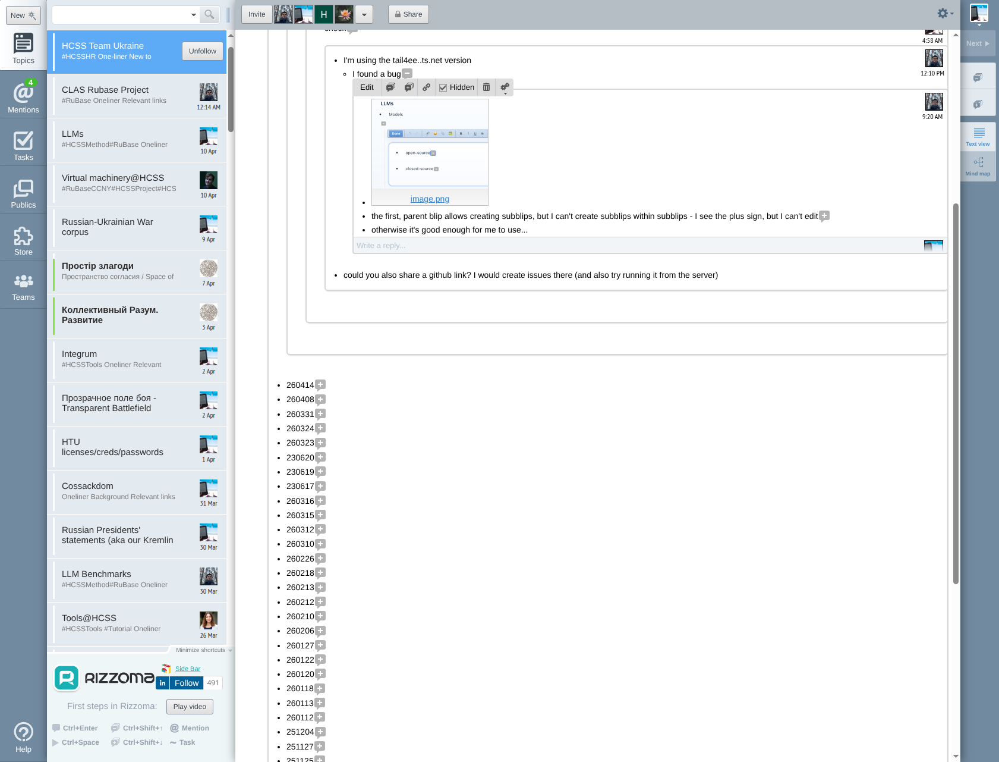

# BUG: Sub-blip nesting — "I cannot create blips within blips"

**Date**: 2026-04-16
**Reporters**: Hryhorii (9:20 AM), Liliia (4:50 PM)
**Location**: [HCSS Team Ukraine topic](https://rizzoma.com/topic/62d6bdc5ec1c533e13df57763219272c)
**Severity**: HIGH — core BLB functionality broken for real users
**Status**: Under investigation

---

## Bug reports (verbatim from original Rizzoma)

### Hryhorii ([blip link](https://rizzoma.com/topic/62d6bdc5ec1c533e13df57763219272c/0_b_cjjg_cp2tg/))
> "the first, parent blip allows creating subblips, but I can't create subblips within subblips - I see the plus sign, but I can't edit"

### Liliia ([blip link](https://rizzoma.com/topic/62d6bdc5ec1c533e13df57763219272c/0_b_cjjg_cp309/))
> "so I can create blips and put emojis, but I cannot create blips within blips"
> "also invited HCSS Ukraine, but cannot access via the browser"
> "It also opens on my computer, not on the browser for some reasons"

---

## What the ORIGINAL Rizzoma looks like (reference — how it SHOULD work)

The original rizzoma.com handles **4-5 levels of nesting** with full fractal rendering. Each level gets:
- Its own toolbar (Edit, reply, link, Hidden, delete, tag)
- Its own reply area ("Write a reply...")
- Proper indentation with slight background shade differences per depth
- User avatar + timestamp on the right
- [+]/[−] inline expansion markers

### Original Rizzoma — deep nesting example (HCSS Team Ukraine → Progress → 260414)

**What's visible**: The "260414" entry expanded to show a conversation thread going 4-5 levels deep:
- "Rizzoma" [−] (depth 1)
  - "has any of you tried running 'my' new Rizzoma locally?" [−] (depth 2)
    - "not yet; but I will today, you once sent a github link" (depth 3 — indented reply)
    - "- would love to get feedback/bugs/..."
  - "now also (PWA) access from the outside" [−] (depth 2)
    - "While we're still debugging." (depth 3)
- "AND I also worked on Android and IOS versions" [−] (depth 1)
  - "[Even though I THINK the PWA mobile version...]" (depth 2)
  - "the Android version (the apk is here) - seems to (prima facie)" [−] (depth 2)
    - "But Liliia - please double-check!!!" (depth 3)
      - "I sent you a request to allow me to see the folder..." (depth 4)
        - "Oh - I thought you had an Android..." (depth 5)
          - "I never did - only Microsoft phone in 2016..." (depth 6!)

### Format observations from the original

| Feature | Original Rizzoma |
|---|---|
| Indentation | Each level indented ~20px further left |
| Background | Alternating subtle shade differences per depth |
| Toolbar | Full toolbar on EVERY blip at EVERY depth |
| Reply area | "Write a reply..." at bottom of every expanded blip |
| [+]/[−] markers | Toggle inline children; work at every depth |
| User avatar | Right-aligned per blip, visible at every depth |
| Timestamp | Right-aligned per blip |
| Max depth | Tested to 6+ levels in this topic |

---

## What OUR implementation does (automated test results)

### Reply-to-reply (via "Write a reply..." textarea) — ✅ WORKS

Tested on localhost via Playwright. Child blip activated → "Write a reply..." appears → typed grandchild text → Reply clicked → grandchild blip created and visible.

The grandchild gets the FULL fractal treatment: own toolbar (Edit, Collapse, Expand, ⤵, ⤴, 🔗, ⚙️), own ProseMirror editor, own "Write a reply..." for great-grandchildren.

### Inline [+] expansion at depth > 1 — ⚠️ NEEDS INVESTIGATION

Hryhorii specifically says "I see the plus sign, but I can't edit." This suggests:
1. The [+] marker RENDERS inside sub-blips
2. Clicking it either does nothing OR shows "Loading" without content
3. The issue may be with Y.js collaborative provider not initializing at depth > 1

---

## Symptoms to investigate

| Symptom | Likely cause |
|---|---|
| "Loading" text where content should be | Blip content fetch failing OR Y.js provider not seeding at depth > 1 |
| "I see the plus sign, but I can't edit" | `collabEnabled` guard in RizzomaBlip.tsx may not fire at depth > 1, OR the inline editor doesn't mount inside an already-expanded child |
| "cannot access via the browser" (Liliia) | CORS, auth, or the tail4ee..ts.net deployment may have different config from localhost |
| "opens on my computer, not on the browser" (Liliia) | The installed PWA/app opens instead of the browser; or a redirect issue |

---

## Questions for Liliia and Hryhorii

1. **Which URL are you using?** (e.g., `https://tail4ee..ts.net/?layout=rizzoma`, or `http://localhost:3000/?layout=rizzoma`)
2. **Desktop browser or Android app?** If browser, which one (Chrome/Firefox/Edge)?
3. **When you say "I cannot create blips within blips", which method are you trying?**
   - **Method A**: Click a child blip to activate it → look for "Write a reply..." at its bottom → type → click Reply
   - **Method B**: Click inside a child blip's text → press `Ctrl+Enter` → expect a [+] inline marker to appear
   - **Method C**: See an existing [+] marker inside a sub-blip → click it → expect it to expand with editable content
4. **What do you see when it fails?** (screenshot appreciated)
   - Nothing happens?
   - "Loading" text?
   - The [+] appears but clicking doesn't open an editor?
   - The editor opens but you can't type?

---

## Next steps

1. Reproduce on the deployed `tail4ee..ts.net` version (not localhost — the bug may be deployment-specific)
2. Check if the `collabEnabled` guard in `RizzomaBlip.tsx` evaluates correctly at depth > 1
3. Check if Y.js `blip:join` fires for grandchild blips and whether the server assigns `shouldSeed: true`
4. Check if the "Loading" state means the blip content fetch timed out or returned empty
5. If confirmed as a code bug, fix the depth guard and test at 3+ levels of nesting
