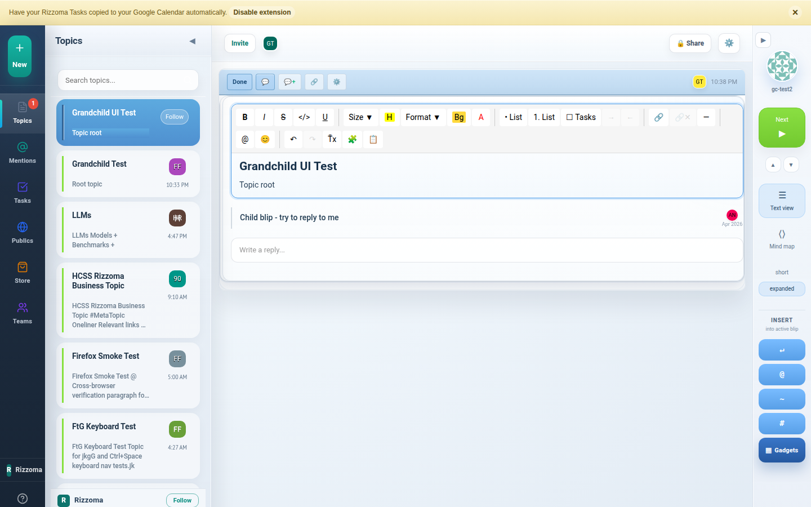
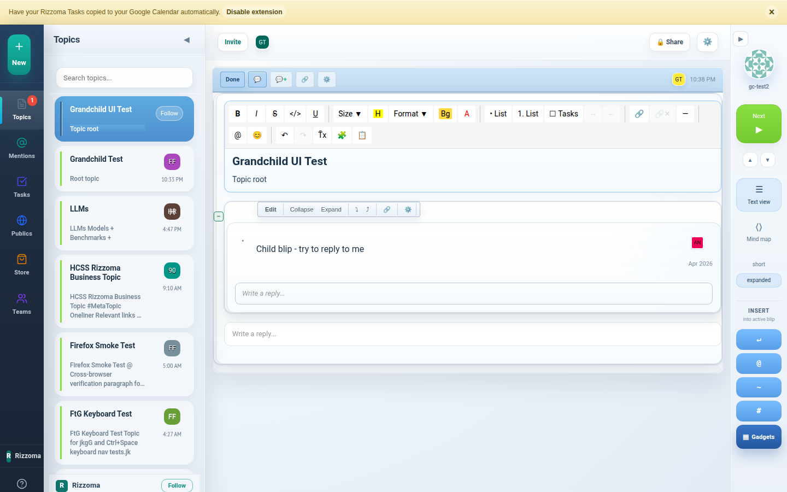
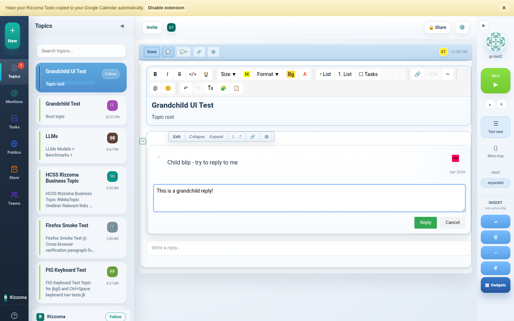
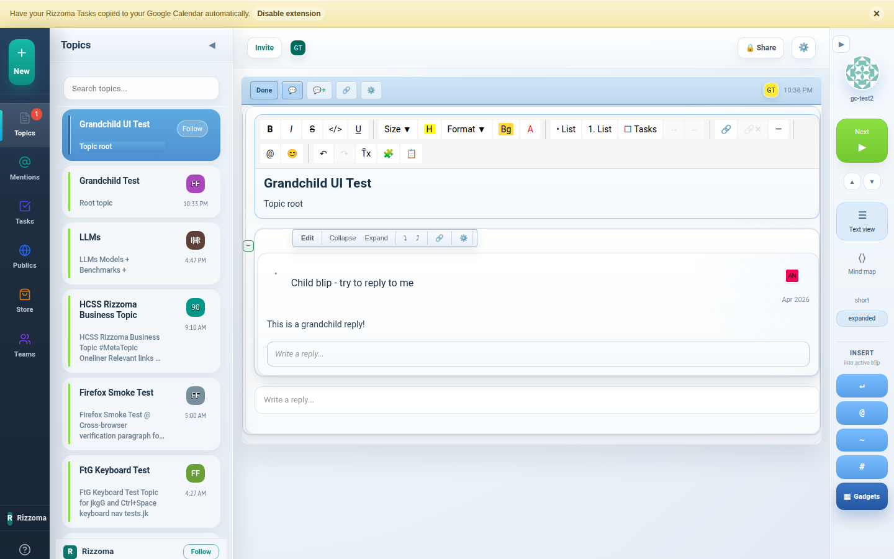
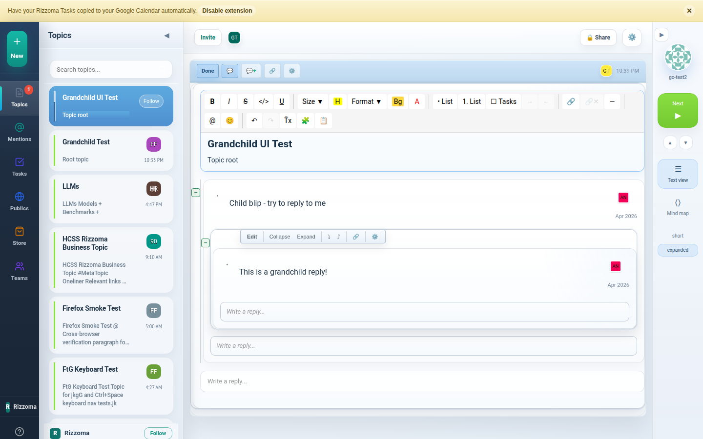

# Grandchild Blip Creation — Test Report & Request for Clarification

**Date**: 2026-04-16
**Tested by**: Claude (automated Playwright, desktop Chromium)
**Status**: ✅ Works in automated testing — need Liliia's specific repro steps

---

## What I tested

Creating a **grandchild blip** (a reply to a reply) via the UI, then expanding it to verify it gets the same fractal rendering as its parent.

## Step-by-step flow (with screenshots)

### Step 1 — Topic with one child blip

Fresh topic "Grandchild UI Test" with one child blip saying "Child blip - try to reply to me."

### Step 2 — Click the child blip to ACTIVATE it

**This is the critical step.** The "Write a reply..." input only appears when a blip is **active** (clicked). If you don't click the child blip first, you won't see a reply area on it — only the topic root has a permanently visible reply area.

After clicking the child blip, it shows:
- A toolbar with **Edit**, **Collapse**, **Expand**, and other buttons
- A **"Write a reply..."** input at the bottom of the expanded child

### Step 3 — Click "Write a reply..." and type

Clicked the "Write a reply..." placeholder → it expanded into a textarea. Typed "This is a grandchild reply!" and a green **Reply** button appeared.

### Step 4 — Click Reply → grandchild appears

After clicking Reply, the grandchild blip was created and appears as a collapsed row inside the child blip: **• This is a grandchild reply!**

### Step 5 — Click the grandchild row to EXPAND it

The grandchild blip expanded into a **full blip with its own toolbar** — identical to how the parent renders:

- Full formatting toolbar (B, I, U, S, Size, Heading, Links, @mentions, Emoji, Undo/Redo, Gadgets)
- Blip action buttons (Edit, Collapse, Expand, ⤵, ⤴, 🔗, ⚙️ gear menu)
- Its own **"Write a reply..."** area (for creating great-grandchildren!)
- Its own ProseMirror editor (for editing the content)

**This is fractal — every depth level gets the same rendering and capabilities.**

---

## API verification

The backend also supports arbitrary nesting. Tested via curl:
- `POST /api/blips` with `parentId` pointing to a child blip → **201 Created** ✅
- `GET /api/waves/:id` returns a nested tree: child → grandchild → (would support great-grandchild) ✅

---

## What I need from Liliia

The grandchild flow works in my automated test. To diagnose your issue, please tell me:

1. **What exactly are you trying to do?**
   - Are you clicking the child blip first to activate it?
   - Are you using the "Write a reply..." input on the child blip?
   - Or are you trying something else (e.g., Ctrl+Enter for an inline child inside a child)?

2. **What do you see when it fails?**
   - Does the "Write a reply..." input not appear at all on the child blip?
   - Does it appear but the Reply button doesn't work?
   - Does the grandchild get created but not show up?
   - Does the grandchild show up but you can't edit it or interact with it?

3. **What device / browser are you using?**
   - Desktop browser (which one? Chrome / Firefox / Safari / Edge?)
   - Android APK (which version?)
   - What URL are you connecting to?

4. **Can you take a screenshot** of exactly what you see when it fails?

---

## Possible causes if it doesn't work for you

| Symptom | Likely cause |
|---|---|
| No "Write a reply..." on the child blip | You need to **click the child blip** first to activate it. The reply input only appears on the active blip. |
| Reply button doesn't respond | Check browser console for errors. May be a CSRF or session issue. |
| Grandchild created but invisible | Page needs a refresh. The blip tree might not re-render after creation in some edge cases. |
| Can't edit the grandchild | Click the grandchild row to expand it, then click **Edit** in its toolbar. |
| Works on desktop but not on mobile | Touch target may be too small, or the active-state click doesn't fire on mobile WebView. This is a known gap — mobile device testing is pending. |

---

**Please share your answers (and a screenshot if possible) so I can reproduce and fix your exact issue.**
